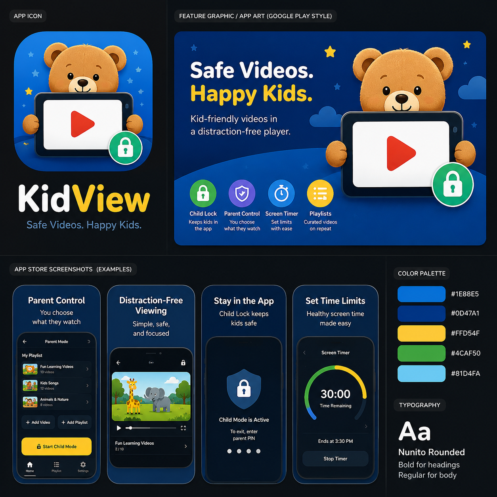

# UI Design Guide

## Brand Reference

Primary artwork:

KidView should feel:

- safe
- cheerful
- focused
- parent-trusting
- kid-friendly without becoming noisy

## Core Message

Primary message:

- `Safe Videos. Happy Kids.`

Secondary message:

- a distraction-free player for parent-approved content

## Visual Direction

The current visual language combines:

- deep blue backgrounds for calm and trust
- bright accent colors for action and recognition
- rounded forms and soft characters for warmth
- high contrast text for readability

The app should avoid:

- harsh error-heavy visuals
- crowded layouts
- generic grayscale utility styling
- overly corporate or enterprise-looking screens

## Color Palette

Palette from the artwork:

- Primary Blue: `#1E88E5`
- Deep Blue: `#0D47A1`
- Accent Yellow: `#FFD54F`
- Safety Green: `#4CAF50`
- Sky Blue: `#81D4FA`

Recommended usage:

- `#0D47A1` for main surfaces, headers, and immersive child-mode backgrounds
- `#1E88E5` for active highlights, buttons, and supporting gradients
- `#FFD54F` for key parent actions like start, confirm, and selected emphasis
- `#4CAF50` for lock, safe-state, and success messaging
- `#81D4FA` for secondary decorative shapes and lighter supporting UI

Suggested neutral support colors:

- Background Near-Black: `#0B1020`
- Surface Navy: `#11233F`
- Divider Blue-Gray: `#2A4268`
- Primary Text: `#FFFFFF`
- Secondary Text: `#B8C7E0`

## Typography

Brand typeface:

- `Nunito Rounded`

Usage guidance:

- bold for headings
- semibold for section titles and buttons
- regular for body copy

Type tone:

- rounded and approachable
- legible at a glance
- friendly without feeling babyish

## Iconography And Motifs

The artwork introduces four recurring themes:

- lock for child mode and safety
- shield for parent control and protection
- timer ring for time limits
- playlist/list icon for approved content collections

Decorative motifs:

- stars
- clouds
- curved blue shapes
- rounded device frames

These should be used lightly in the production app so the UI stays calm.

## Screen Design Principles

### Parent Screens

Parent screens should feel:

- organized
- trustworthy
- quick to use one-handed

Recommended characteristics:

- card-based grouping
- clear primary actions
- visible current selection
- low-friction add and edit flows

### Child Mode

Child mode should feel:

- immersive
- uncluttered
- visually secure

Recommended characteristics:

- full-screen player
- minimal chrome
- hidden parent-only controls
- strong contrast and clear status messaging

### Time Limits

Time-limit screens should feel:

- supportive rather than punishing
- easy to understand at a glance

Recommended characteristics:

- circular or semi-circular timer indicators
- large time remaining value
- calm language

## Key Screens To Match

### Parent Home

Should include:

- approved playlists and videos
- selected media highlight
- add video and add playlist actions
- start child mode action
- clear navigation to settings and timer tools

### Add Media

Should include:

- paste link field
- media type preview
- optional display title
- optional parent note

### Child Mode Player

Should include:

- full-screen video focus
- minimal status bar or hidden chrome
- no inviting non-parent interactions

### Time Limits

Should include:

- time remaining display
- end time
- parent-only adjustment controls

## Motion

Use motion sparingly:

- screen transitions should be smooth and calm
- child-mode entry should feel intentional
- button and selection feedback should be soft and short

Avoid:

- bouncy novelty animations on core flows
- constant pulsing
- distracting autoplay transitions

## Accessibility

The visual system should preserve:

- high contrast for primary text
- large tap targets for parent controls
- readable headings at phone size
- color-independent meaning where possible

Accessibility checks should include:

- dynamic type behavior
- color contrast
- VoiceOver and TalkBack labels
- left and right thumb reach for common controls

## Asset Guidance

Needed production assets:

- exported app icons for Android and iOS
- launch and marketing graphics
- store screenshots based on the brand board
- lock, timer, shield, and playlist icon set

Repository recommendation:

- keep final exported assets under a future top-level `assets/` folder
- keep brand reference docs and planning graphics under `docs/assets/`

## Implementation Notes

Android:

- align Compose theme tokens with this palette
- replace placeholder visual styling with KidView-specific tokens

iOS:

- build a matching SwiftUI theme layer once the Xcode project is live
- use rounded corners, soft gradients, and friendly spacing consistently
